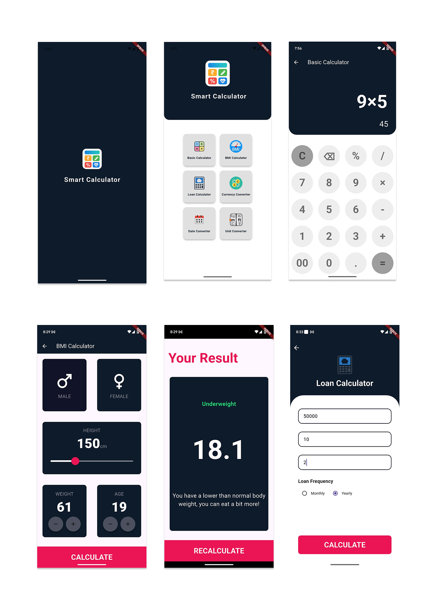

# 🧮 Smart Calculator App

Smart Calculator is an all-in-one **Flutter-based calculator app** designed to simplify everyday calculations.  
It combines powerful tools like **Snap Calculator (OCR)**, financial calculators, and converters with a clean and modern UI.

---

## ✨ Features

- ➕ **Basic Calculator**  
  Perform simple arithmetic operations (+, −, ×, ÷)

- 💰 **Loan & EMI Calculator**  
  Calculate EMI, interest, and total loan payments easily

- 📸 **Snap Calculator (OCR)**  
  Take a picture of a math expression and get instant results

- 📅 **Date Calculator**  
  Convert and calculate dates using APIs

- 📏 **Unit Converter**  
  Convert units like length, weight, temperature, etc.

- 💱 **Currency Converter**  
  Real-time currency conversion using APIs

- 🎨 **User-Friendly UI**  
  Clean, simple, and responsive design

---

## 🛠 Tech Stack

- **Language:** Dart  
- **Framework:** Flutter  
- **Architecture:** Clean UI with modular structure  
- **APIs Used:**  
  - Currency Conversion API  
  - Unit Conversion API  
  - Date Conversion API  
- **Libraries:**  
  - OCR (ML Kit / similar) for Snap Calculator  

---

## 📸 Screenshots

<p align="center">
  
  
  
</p>

---

## 🚀 Installation

1. Clone the repository:
   ```bash
   git clone https://github.com/sara12472/smart_calc/tree/master/lib
